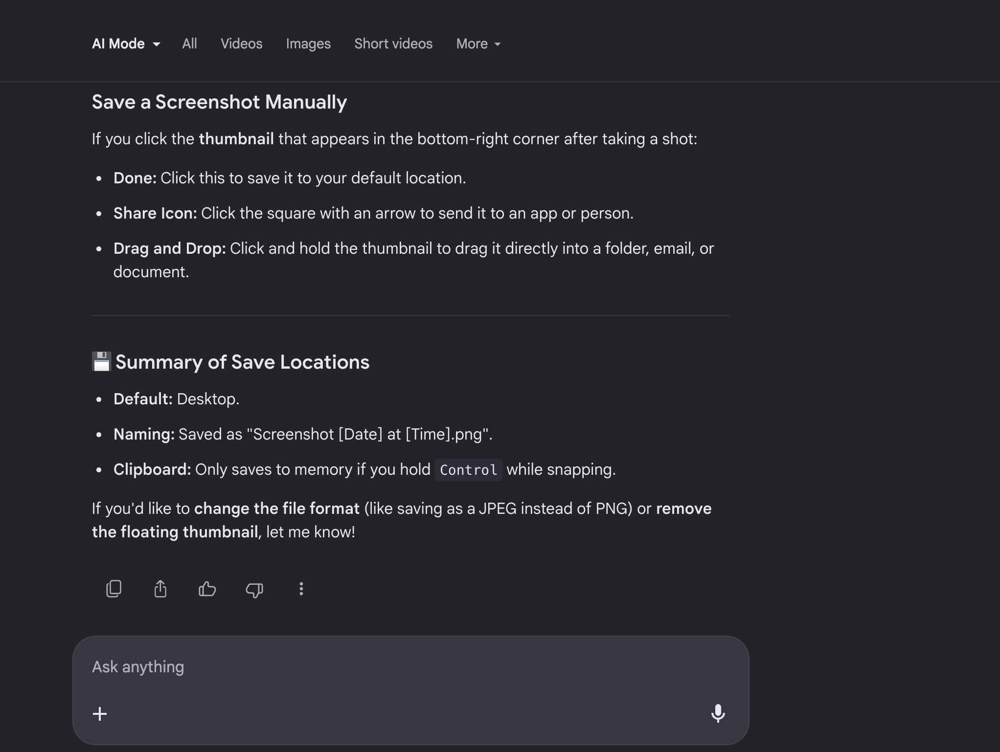

# Deploy a Custom Apache Web Server on EC2

## 📌 Project Overview
In this project, I deployed a custom web server using Apache on an Amazon EC2 instance running Amazon Linux 2023. The setup was automated using User Data, allowing the server and a custom webpage to be configured automatically at launch.

## 🚀 What I Did
- Launched an EC2 instance on AWS
- Configured security groups to allow HTTP and SSH access
- Installed and started Apache (httpd)
- Automated setup using EC2 User Data
- Deployed a custom-designed HTML webpage

## 🛠️ Technologies Used
- Amazon EC2  
- Amazon Linux 2023  
- Apache (httpd)  
- Bash scripting (User Data)

## ⚙️ Setup Instructions

### 1. Launch EC2 Instance
- AMI: Amazon Linux 2023  
- Instance Type: t2.micro  
- Enabled Auto-assign Public IP  
- Configured Security Group:
  - HTTP (80) – Anywhere  
  - SSH (22) – My IP  

### 2. User Data Script
```bash
#!/bin/bash
dnf update -y
dnf install -y httpd
systemctl start httpd
systemctl enable httpd
chown -R ec2-user:ec2-user /var/www/html

cat <<EOF > /var/www/html/index.html
<!DOCTYPE html>
<html>
<head>
<title>My Apache Server</title>
</head>
<body>
<h1>Welcome to My Custom Apache Web Server!</h1>
<p>Deployed on AWS EC2 using User Data.</p>
</body>
</html>
EOF

systemctl restart httpd
```

Result:
- The EC2 instance was successfully launched
- Apache web server was installed and configured automatically
- Custom webpage was deployed and accessible via public IP address

## 📸 Screenshots

### 1. User Data Script

> This script automates the entire Apache web server setup on launch.
> Instead of manually SSHing into the instance, I used a User Data bash
> script to install Apache, start the service, enable it on reboot, and
> deploy a custom HTML page — all automatically when EC2 first boots.
